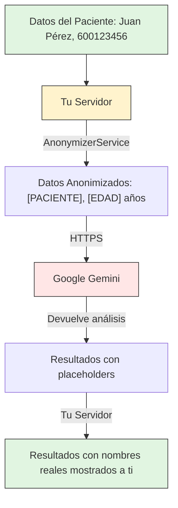

# 05. Seguridad y Privacidad

**(Sección completa – MVP del Asistente Clínico de Fisioterapia)**

## 1. Enfoque general

Desde el MVP, el sistema debe tratar toda la información como **datos clínicos sensibles**, independientemente del marco legal específico del país. El diseño asume un estándar alto de protección desde el inicio para evitar rediseños futuros y generar confianza inmediata en el profesional.

El sistema **no está orientado a investigación**, **no entrena modelos externos**, y **no comparte datos** bajo ninguna circunstancia en esta fase.

---

## 2. Principios de Seguridad

1. **Minimización de datos**

   Solo se almacenan los datos estrictamente necesarios para la práctica clínica.

2. **Decisión humana central**

   Ningún proceso automatizado toma decisiones clínicas ni actúa sin supervisión humana.

3. **Simplicidad segura**

   Se priorizan soluciones simples, probadas y mantenibles frente a arquitecturas complejas.

4. **Cero pérdida de datos**

   La pérdida de información clínica se considera un fallo crítico.

---

## 3. Autenticación y Acceso

- Acceso restringido únicamente al profesional autorizado.
- Autenticación mediante credenciales fuertes.
- Sesión persistente controlada (evitar reautenticación constante para no afectar la experiencia).
- No existen usuarios anónimos ni accesos públicos.
- No se implementan roles complejos en el MVP.

---

## 4. Comunicación Segura

- Todo el tráfico entre cliente y servidor se realiza mediante **HTTPS/TLS**.
- No se permiten conexiones sin cifrado.
- Certificados gestionados automáticamente y renovados de forma periódica.

---

## 5. Almacenamiento de Datos Clínicos

### 5.1 Base de datos

- Base de datos relacional protegida (PostgreSQL).
- Sin acceso directo desde Internet.
- Acceso exclusivo desde el backend mediante credenciales seguras.
- Registro de creación y modificación de registros clínicos.

### 5.2 Separación de responsabilidades

- Datos estructurados (pacientes, sesiones, observaciones) separados de archivos binarios (imágenes).
- Ningún archivo se almacena directamente en la base de datos.

---

## 6. Imágenes y Archivos Clínicos

- Almacenamiento en **object storage privado** (S3 compatible).
- Acceso únicamente mediante URLs firmadas con expiración.
- No existen URLs públicas permanentes.
- Cada imagen debe estar obligatoriamente asociada a:
  - Un paciente
  - Una sesión
  - Una fecha

Esto garantiza trazabilidad clínica y evita archivos huérfanos.

---

## 7. Backups y Recuperación

- Backups automáticos diarios de la base de datos.
- Retención mínima de 30 días.
- Backups cifrados.
- Procedimiento documentado de restauración.
- Pruebas periódicas de recuperación para verificar integridad.

---

## 8. Auditoría y Trazabilidad

- Registro de:
  - Cuándo se crea un paciente
  - Cuándo se añade una sesión
  - Cuándo se modifican observaciones
- Historial clínico inmutable por sesión.
- El sistema **no borra información clínica**, solo permite añadir correcciones o nuevas observaciones.

---

## 9. Privacidad del Paciente

- Acceso exclusivo del profesional responsable.
- No se comparten datos con terceros.
- No se utilizan datos para:
  - entrenamiento de modelos externos
  - análisis comerciales
  - estudios agregados
- No existe exportación automática de datos en el MVP.

---

## 10. Uso de Inteligencia Artificial (MVP)

En el MVP:

- ❌ No se utilizan servicios de IA externos.
- ❌ No se envían datos clínicos a modelos de terceros.
- ❌ No se generan recomendaciones automáticas.

Esto es intencional para preservar privacidad y control total.

---

## 11. Preparación para fases futuras (sin activar)

La arquitectura queda preparada para, en fases posteriores:

- Introducir IA **aislada en servicios independientes**
- Anonimizar datos antes de cualquier procesamiento avanzado
- Aplicar controles explícitos de consentimiento

Nada de esto se activa en el MVP.

---

## 12. Inteligencia Artificial y Privacidad (Fase 15)

### 12.1 Anonimización antes de enviar a IA

Cuando utilizas la función **"Analizar con IA"**, el sistema protege la privacidad de tus pacientes mediante un proceso de anonimización automática:

**Datos que se protegen:**

| Dato Original          | Lo que ve la IA                    | Protección                 |
| ---------------------- | ---------------------------------- | -------------------------- |
| Nombre del paciente    | `[PACIENTE]`                       | Identidad oculta           |
| Fecha de nacimiento    | `[EDAD] años (36)`                 | Solo edad, no fecha exacta |
| Teléfono               | **Eliminado**                      | No se envía                |
| Email                  | **Eliminado**                      | No se envía                |
| Contacto de emergencia | **Eliminado**                      | No se envía                |
| Fechas específicas     | Tiempo relativo ("hace 3 semanas") | Sin fechas exactas         |

**Ejemplo real:**

```
ANTES DE ANONIMIZAR:
"Juan Pérez, nacido el 15/03/1990, teléfono 600123456,
reporta dolor lumbar desde el 10/01/2024"

DESPUÉS DE ANONIMIZAR:
"[PACIENTE], [EDAD] años (36),
reporta dolor lumbar desde hace 3 semanas"
```

### 12.2 Qué nunca sale de tu servidor

**Nunca abandonan tu infraestructura:**

- Nombres reales de pacientes
- Teléfonos y correos electrónicos
- Grabaciones de voz originales
- Imágenes médicas y posturogramas
- Datos completos de evaluación

**Mapeos temporales:**

- El sistema recuerda temporalmente qué placeholder pertenece a qué paciente
- Esta memoria se borra automáticamente después de mostrarte los resultados
- No se almacena permanentemente información que identifique al paciente

### 12.3 Qué llega a la IA externa

**Únicamente esta información llega a Google Gemini:**

- Descripciones clínicas anonimizadas
- Escalas de dolor y síntomas
- Resultados de análisis de posturogramas
- Resúmenes de sesiones de tratamiento
- Citas de literatura médica

### 12.4 Compromisos de privacidad

- **Sin datos de entrenamiento** - Google no utiliza tus datos de pacientes para entrenar modelos
- **Sin retención** - Los datos anonimizados no se almacenan en servidores externos
- **Solo citas de libros** - Las recomendaciones citan contenido de libros médicos, nunca casos de pacientes
- **Audit trail mínimo** - El sistema solo registra ID de caso y timestamp, nunca datos del paciente

### 12.5 Flujo de datos

**Versión simple:** Los datos del paciente permanecen en tu servidor → Solo descripciones anonimizadas van a Google → Los resultados regresan con placeholders → Tu servidor completa con los nombres reales



### 12.6 Notas de cumplimiento

**Lo que hace el software:**

- Elimina toda la información de identificación personal antes de las llamadas a la API externa
- No almacena datos de pacientes en servidores externos
- No utiliza datos de pacientes para entrenar modelos de IA
- Mantiene logs de auditoría sin información que identifique al paciente

**Lo que necesitas verificar:**

- Asegúrate de que tu cuenta de Google Cloud tenga acuerdos de procesamiento de datos apropiados
- Verifica si tu región requiere consentimiento específico para herramientas clínicas asistidas por IA
- Comprueba el cumplimiento con regulaciones locales de datos de salud (HIPAA, GDPR, etc.)
- Considera las políticas de consentimiento del paciente para análisis asistido por IA

Las salvaguardas técnicas están en su lugar, pero el cumplimiento regulatorio depende de tu jurisdicción específica y los requisitos de tu práctica.

---

## 13. Cierre

La seguridad y la privacidad no son funcionalidades añadidas, sino **condiciones de existencia del sistema**.

Este enfoque garantiza que el producto sea confiable desde el primer uso, y viable para una evolución futura hacia un entorno clínico-comercial sin rediseños estructurales.
