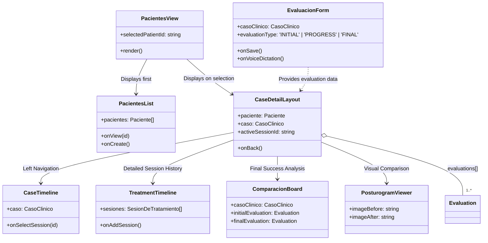
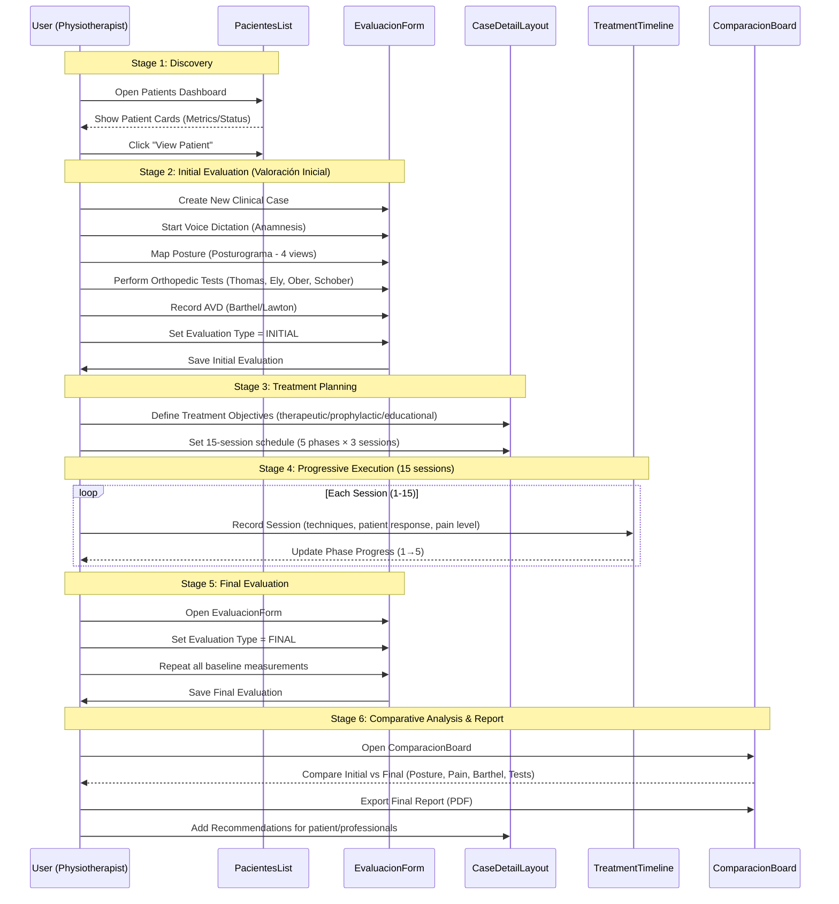

# Patient Journey Flow - Design OS (Pacientes)

This document outlines the architectural flow and patient journey within the **Pacientes** section of Design OS. It illustrates how components interact to transition a patient from initial admission to long-term evolution tracking.

## Clinical Model (Doctor's Requirements)

Based on clinical expertise, the treatment process follows a **6-stage flow**:

### Treatment Stages

| Stage | Spanish Name            | Description                                                                      | Data Entities                                      |
| ----- | ----------------------- | -------------------------------------------------------------------------------- | -------------------------------------------------- |
| **1** | Valoración Inicial      | Anamnesis + kinetic-functional exam (posturogram, pain points, orthopedic tests) | `Evaluation (INITIAL)`                             |
| **2** | Diagnóstico + Objetivos | Functional diagnosis + therapeutic/prophylactic/educational objectives           | `Evaluation.diagnosis`, `TreatmentPlan.objectives` |
| **3** | Planificación           | Select techniques, establish 15-session schedule across 5 weeks                  | `TreatmentPlan.phases[]`                           |
| **4** | Ejecución Progresiva    | 5 phases of treatment (initial→intermediate→advanced) with per-session tracking  | `TreatmentSession[]`                               |
| **5** | Evaluación Final        | Second comprehensive evaluation to measure outcomes                              | `Evaluation (FINAL)`                               |
| **6** | Recomendaciones         | Treatment report with suggestions for patient and other professionals            | `CaseRecommendations` (future)                     |

### Evaluation Model

The patient undergoes **two formal comprehensive evaluations**:

1. **Evaluación Inicial (Initial)**: Baseline at treatment start
   - Posturogram (4 anatomical views)
   - Pain scale (END 0-10)
   - Orthopedic tests (Thomas, Ely, Ober, Schober)
   - Functional indices (Barthel 0-100, Lawton 0-8)

2. **Evaluación Final (Final)**: After 15-session intervention
   - Same metrics as initial for comparison
   - Validates treatment effectiveness

**Evolution tracking** (Evolución Kinésica) happens per-session via `TreatmentSession` records, not full evaluations.

---

## 1. Architectural Overview (UML Class Diagram)

The following diagram shows the relationship between the main view components and the data structures they manage.



## 2. Patient Journey Flow (Sequence Diagram)

This diagram tracks the lifecycle of a patient interaction, from discovery to final report.



## 3. Journey Stages Breakdown

### Stage 1: Discovery (Dashboard)

- **Main Component:** `PatientList.tsx`
- **Goal:** Quick status check of the patient population.
- **Key Action:** Identify which patients need attention based on active case status and pain trends.

### Stage 2: Initial Evaluation (Valoración Inicial)

- **Main Component:** `EvaluacionForm.tsx`
- **Goal:** Establish the "Initial State" using kinetic-functional metrics.
- **Evaluation Type:** `INITIAL`
- **Input Methods:**
  - **Voice:** AI-structured anamnesis.
  - **Visual:** Interactive body map (Posturograma - 4 anatomical views).
  - **Clinical:** Numeric results for orthopedic and functional tests.

### Stage 3: Treatment Planning

- **Main Component:** `CaseDetailLayout.tsx` (Treatment Plan section)
- **Goal:** Define objectives and 15-session schedule.
- **Objectives:** Therapeutic, Prophylactic, Educational
- **Schedule:** 5 phases × 3 sessions/phase = 15 sessions over 5 weeks

### Stage 4: Progressive Execution (Evolución Kinésica)

- **Main Components:** `CaseDetailLayout.tsx`, `CaseTimeline.tsx`, `TreatmentTimeline.tsx`
- **Goal:** Track the 15-session intervention model across 5 phases.
- **Phases:**
  1. Initial: Gentle mobilizations, pain relief
  2. Early-Intermediate: Begin stretching
  3. Intermediate: Flexibility gains
  4. Late-Intermediate: Therapeutic exercises
  5. Advanced: Functional strengthening, confidence building

### Stage 5: Final Evaluation

- **Main Component:** `EvaluacionForm.tsx`
- **Goal:** Comprehensive re-measurement to compare with baseline.
- **Evaluation Type:** `FINAL`
- **Same measurements as Initial:** Posturogram, Pain (END), Orthopedic tests, AVD indices

### Stage 6: Comparative Analysis & Report

- **Main Components:** `PosturogramViewer.tsx`, `ComparacionBoard.tsx`
- **Goal:** Visual and clinical validation of the treatment plan.
- **Comparison:** Initial vs Final evaluation data
- **Output:** PDF report with comparative charts (pain reduction, functional improvement)
- **Future:** `CaseRecommendations` for treatment continuation suggestions

## 4. Data Flow Principles

1.  **Top-Down Props:** Data flows from `PacientesView` down to specialized components.
2.  **Evaluations Array:** `ClinicalCase.evaluations[]` contains multiple evaluations (Initial, Progress, Final).
3.  **Utility Functions:** Use `getInitialEvaluation()`, `getFinalEvaluation()` to access specific evaluations.
4.  **Encapsulated Logic:** `EvaluacionForm` handles its own complex state before emitting `onSave`.
5.  **Visual Consistency:** Components use the Design OS aesthetic (Stone/Lime palette).

## 5. Data Model Notes

### Key Relationships

```
Patient (1) ──> (*) ClinicalCase
ClinicalCase (1) ──> (*) Evaluation    ← 1:N (INITIAL, PROGRESS, FINAL)
ClinicalCase (1) ──> (1) TreatmentPlan
ClinicalCase (1) ──> (*) TreatmentSession
Evaluation (1) ──> (*) Footprint
Evaluation (1) ──> (*) PostureVideo
```

### Evaluation Types

| Type       | Purpose                        | When Created      |
| ---------- | ------------------------------ | ----------------- |
| `INITIAL`  | Baseline measurement           | Case creation     |
| `PROGRESS` | Mid-treatment check (optional) | During treatment  |
| `FINAL`    | Outcome measurement            | After 15 sessions |

---

**Last Updated:** 2026-01-17
