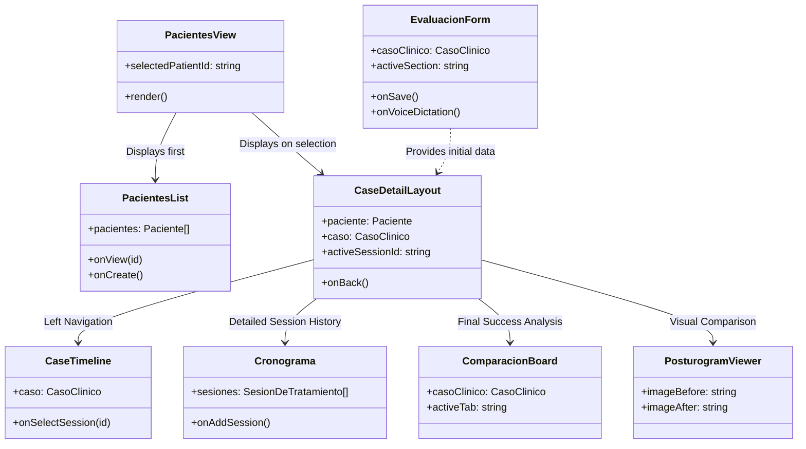
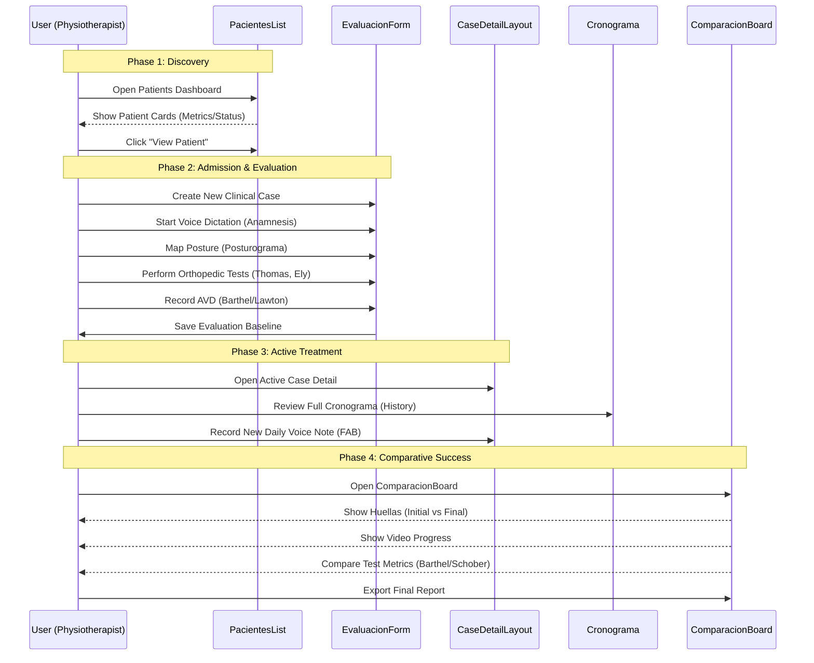

# Patient Journey Flow - Design OS (Pacientes)

This document outlines the architectural flow and patient journey within the **Pacientes** section of Design OS. It illustrates how components interact to transition a patient from initial admission to long-term evolution tracking.

## 1. Architectural Overview (UML Class Diagram)

The following diagram shows the relationship between the main view components and the data structures they manage.

## 2. Patient Journey Flow (Sequence Diagram)

This diagram tracks the lifecycle of a patient interaction, from discovery to active treatment.

## 3. Journey Stages Breakdown

### Stage 1: Discovery (Dashboard)
*   **Main Component:** `PacientesList.tsx`
*   **Goal:** Quick status check of the patient population.
*   **Key Action:** Identify which patients need attention based on active case status and pain trends.

### Stage 2: Admission & Functional Baseline
*   **Main Component:** `EvaluacionForm.tsx`
*   **Goal:** Establish the "Initial State" using kinetic-functional metrics.
*   **Input Methods:** 
    *   **Voice:** AI-structured anamnesis.
    *   **Visual:** Interactive body map (Posturograma).
    *   **Clinical:** Numeric results for orthopedic and functional tests.

### Stage 3: Treatment Evolution (The "Bitácora")
*   **Main Components:** `CaseDetailLayout.tsx`, `CaseTimeline.tsx`, `Cronograma.tsx`
*   **Goal:** Track the 15-session intervention model across 4 phases.
*   **CaseTimeline:** Quick sidebar navigation for active context.
*   **Cronograma:** Detailed vertical log showing techniques applied and patient response for every visit.

### Stage 4: Analysis & Final Outcome
*   **Main Components:** `PosturogramViewer.tsx`, `ComparacionBoard.tsx`
*   **Goal:** Visual and clinical validation of the treatment plan.
*   **PosturogramViewer:** Focused "Before/After" slider for specific postural photos.
*   **ComparacionBoard:** The comprehensive "Outcome Report" comparing initial baseline vs. final results across Footprints (Huellas), Video, and functional tests.

## 4. Data Flow Principles

1.  **Top-Down Props:** Data flows from `PacientesView` down to specialized components.
2.  **Encapsulated Logic:** `EvaluacionForm` handles its own complex state (posturograma parts, test scores) before emitting a single `onSave` event.
3.  **Visual Consistency:** Components use the **Design OS "Refined Utility"** aesthetic (Stone/Lime palette) to maintain a premium feel across all journey stages.
