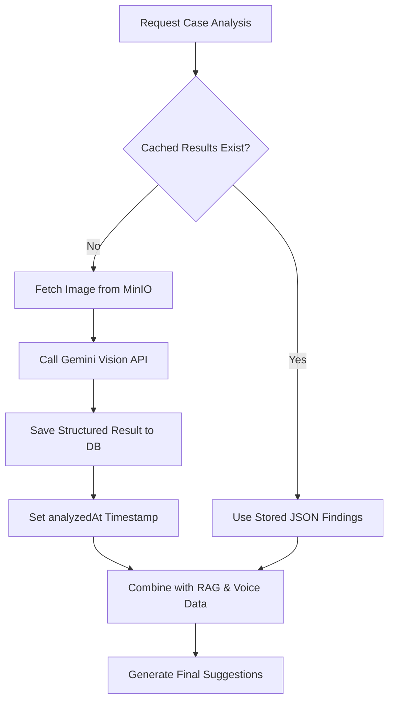

# AI Vision Integration

Mamirri uses AI Vision to analyze clinical images, such as footprint scans and posturograms, providing therapists with structured clinical findings without the manual effort of marking every deviation.

To keep costs low and performance high, the system uses a hybrid caching strategy that ensures each image is analyzed by the expensive Vision AI only once.

---

## How Vision Integration Works

### The Hybrid Caching Strategy

The system doesn't analyze images immediately upon upload. Instead, it waits until a case analysis is requested. This avoids wasting API calls on images that might be deleted or never used.

#### Strategy Overview

```
┌─────────────────────────────────────────────────────────────────────────────┐
│                     HYBRID STRATEGY WITH CACHING                            │
├─────────────────────────────────────────────────────────────────────────────┤
│                                                                             │
│  UPLOAD FOOTPRINT                                                           │
│  ┌─────────────┐     ┌─────────────┐     ┌─────────────┐                    │
│  │   Upload    │ ──► │  Save to    │ ──► │ Create DB   │                    │
│  │   Image     │     │   MinIO     │     │   Record    │                    │
│  └─────────────┘     └─────────────┘     └─────────────┘                    │
│                                               │                              │
│                                               ▼                              │
│                                    footprint.analysis = NULL                 │
│                                    (NO analysis yet - that's OK)            │
│                                                                             │
├─────────────────────────────────────────────────────────────────────────────┤
│                                                                             │
│  ANALYZE CASE (First Time)                                                  │
│  ┌─────────────┐     ┌─────────────┐     ┌─────────────┐                    │
│  │   Check     │ ──► │  analysis   │ YES │ Use cached  │                    │
│  │   Cache     │     │  exists?    │ ──► │  findings   │                    │
│  └─────────────┘     └─────────────┘     └─────────────┘                    │
│                            │ NO                                              │
│                            ▼                                                 │
│                   ┌─────────────┐     ┌─────────────┐                       │
│                   │   Vision    │ ──► │   SAVE to   │ ◄── KEY: Cache it!   │
│                   │   Service   │     │   DB        │                       │
│                   └─────────────┘     └─────────────┘                       │
│                                                                             │
├─────────────────────────────────────────────────────────────────────────────┤
│                                                                             │
│  ANALYZE CASE (Subsequent)                                                  │
│  ┌─────────────┐     ┌─────────────┐     ┌─────────────┐                    │
│  │   Check     │ ──► │  analysis   │ YES │ Use cached  │ ◄── FREE!         │
│  │   Cache     │     │  exists?    │ ──► │  findings   │                    │
│  └─────────────┘     └─────────────┘     └─────────────┘                    │
│                                                                             │
├─────────────────────────────────────────────────────────────────────────────┤
│                                                                             │
│  OPTIONAL: Force Re-analyze                                                 │
│  ┌─────────────┐                                                            │
│  │   User      │ ──► forceVision=true ──► Fresh Vision API call           │
│  │   Requests  │                                                            │
│  └─────────────┘                                                            │
│                                                                             │
└─────────────────────────────────────────────────────────────────────────────┘
```

#### Key Benefits

1.  **First Analysis**: When you click **Analyze with AI**, the system checks if the footprint images have existing results. If the `analysis` field is empty, it calls the Gemini Vision API.
2.  **Storage**: The structured findings (JSON) are saved back to the database, along with an `analyzedAt` timestamp.
3.  **Subsequent Calls**: Any future analysis of the same case will reuse the stored findings. This makes the analysis instant and free for all repeat requests.
4.  **Cost Efficiency**: Each image is analyzed only once, regardless of how many times the case is analyzed
5.  **Flexibility**: Optional `forceVision=true` parameter allows bypassing cache when needed

### Parallel Processing

If a clinical case has multiple images, Mamirri analyzes them concurrently. This keeps the total processing time roughly equal to the time it takes to analyze a single image (~3-5 seconds), regardless of how many images are attached to the case.

---

## Technical Architecture

### Component Breakdown

- **VisionService**: The core service that communicates with Google Gemini. It handles image buffering, MIME type inference, and structured output parsing.
- **DataAggregationService**: The "brain" that decides whether to fetch fresh analysis or use cached data. It orchestrates the parallel processing of multiple images.
- **StorageService**: Retrieves the raw image buffers from MinIO so they can be sent to the Vision API.

### Data Flow



---

## Using Vision AI

### Automatic Analysis

Vision analysis happens automatically as part of the standard case analysis flow. You don't need to click anything extra. If images are present, they will be included in the AI's "understanding" of the case.

### Force Re-analysis

If you've uploaded better quality images or believe the AI's first interpretation was incorrect, you can force a fresh analysis.

**From the API:**
Add the `forceVision=true` query parameter to your request:
`POST /api/v1/ai/cases/:caseId/analyze?forceVision=true`

This will bypass the database cache, make fresh calls to the Vision API, and overwrite the stored findings with new ones.

---

## Troubleshooting Vision Issues

### "No image analysis available" warning

This usually means the case has no footprint images attached. Ensure you've uploaded images to the **Multimedia** section of the evaluation.

### Analysis Failures

If a specific image fails to analyze (e.g., due to poor quality or API timeout), the system won't crash. It will:

1. Log the error for the specific image ID.
2. Continue analyzing any other available images.
3. Include the failure in the metadata so you can see which image was skipped.

### High Latency

The first analysis of a case with many images can take 5-8 seconds. Subsequent analyses should drop to under 2 seconds since the vision data is served directly from your database.

---

## Data Schema Reference

The vision results are stored in the `Footprint` model:

| Field        | Type       | Description                                            |
| :----------- | :--------- | :----------------------------------------------------- |
| `analysis`   | `Json`     | The structured findings (e.g., arch type, deviations). |
| `analyzedAt` | `DateTime` | When the last successful AI analysis occurred.         |
| `url`        | `String`   | The path to the raw image in MinIO.                    |

---

**Last Modified:** 2026-02-07
