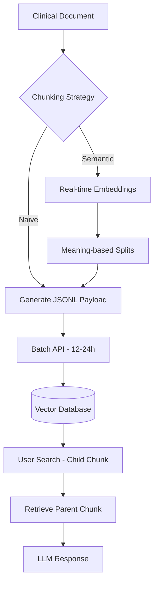

# Ingestion Architecture

This document outlines how Mamirri App processes and retrieves clinical data using the "Small-to-Big Retrieval" strategy. This approach balances search accuracy with the rich context an LLM needs to provide high-quality insights.

## Use Small-to-Big Retrieval for better context

Traditional RAG (Retrieval-Augmented Generation) often searches for the same chunks it sends to the LLM. This creates a trade-off: small chunks are great for pinpointing specific information, but they lack the surrounding context. Large chunks provide great context but can "dilute" the search signal.

Mamirri App uses a **Small-to-Big** strategy to solve this:

1.  **Search the Child**: We search across small (~500 word) chunks to find the most relevant snippets.
2.  **Retrieve the Parent**: Once we find a relevant child, we retrieve its "parent" (~2500 word) chunk.
3.  **Feed the LLM**: The LLM receives the full parent chunk, giving it enough context to understand the broader clinical picture.

### Why we embed both chunks

While we primarily search children, we store embeddings for both parent and child chunks for two reasons:

- **Fallback Search**: If a specific query doesn't match a child chunk well (e.g., a very broad topical query), searching the parent embeddings can act as a reliable fallback.
- **Database Constraints**: Some vector databases perform better with uniform chunk sizes. By embedding both, we ensure we always have a valid search target regardless of the retrieval depth needed.

---

## Choose the right chunking strategy

The way you split documents significantly impacts both cost and quality. We support two main strategies:

### Naive Chunking (Recommended for most cases)

Naive chunking splits documents based on a fixed word or character count.

- **Speed**: Near-instant. There is zero pre-computation cost.
- **Compatibility**: Fully compatible with our asynchronous Batch API flow.
- **Best for**: High-volume ingestion where speed and cost-efficiency are priorities.

### Semantic Chunking (High Quality)

Semantic chunking uses embeddings to find natural breaks in the text, ensuring that chunks are split based on shifts in meaning rather than arbitrary word counts.

- **The "Double Cost" Nuance**: This strategy requires a real-time embedding call _first_ to calculate the semantic similarity between sentences and decide where to cut. After splitting, we then send the resulting chunks to the Batch API for permanent storage.
- **Timing Constraints**: Because you need the results of the first embedding call to perform the split, this part of the process cannot be fully asynchronous. You can't wait 12 hours for the Batch API just to decide where to cut the text.
- **Best for**: Highly technical or complex clinical documents where preserving the integrity of a "thought" is critical.

---

## Optimize costs with the Batch API

For bulk ingestion, Mamirri App uses the OpenAI Batch API. This is the primary engine for processing thousands of clinical documents at once.

### How the workflow works

1.  **Generate JSONL**: The server generates a `.jsonl` file where each line is an embedding request for a specific chunk.
2.  **Upload and Execute**: The file is uploaded to the provider, and the batch job starts.
3.  **Async Processing**: Jobs take between 12 and 24 hours to complete. The system polls for completion or waits for a webhook.
4.  **Ingest Results**: Once complete, the system downloads the results and populates the vector database.

### The benefits

- **33% Cost Reduction**: Batch requests are significantly cheaper than real-time API calls.
- **Higher Rate Limits**: Batch jobs typically don't count against your real-time TPM (Tokens Per Minute) limits, preventing ingestion from blocking live user queries.

---

## Technical Flow Overview

