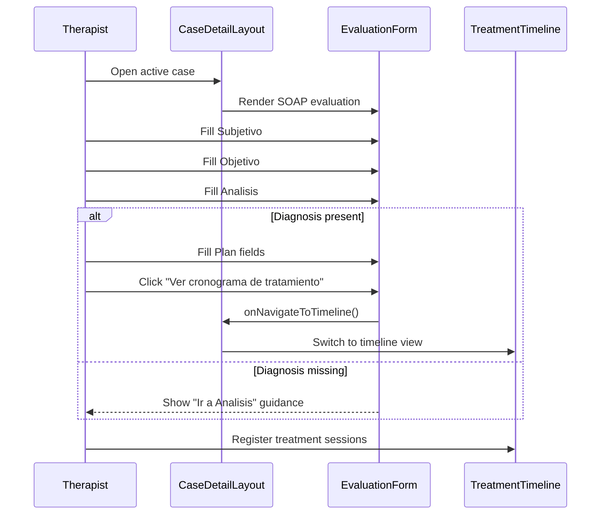

# Patient Journey Flow (Pacientes)

This document describes the current patient evaluation flow in the Pacientes module and how SOAP documentation connects to treatment execution.

## Current clinical flow

The current implementation uses a SOAP-first, diagnosis-first flow:

1. Create or open a patient case
2. Complete SOAP evaluation in this order:
   - `S - Subjetivo`
   - `O - Objetivo`
   - `A - Analisis`
   - `P - Plan`
3. Use **Plan** to define intended treatment strategy
4. Move to **Cronograma** to execute and track sessions
5. Review progress through timeline and comparison views

## Why this flow exists

The flow reduces cognitive load for therapists during real consultations:

- Diagnosis is explicit before planning
- Objective tests are added only when needed
- Plan is actionable (not a placeholder)
- Timeline is focused on execution, not planning intent

## SOAP responsibilities in Mamirri

### S - Subjetivo

- Capture patient-reported symptoms and history
- Voice recording and transcription support subjective capture

### O - Objetivo

- Capture measurable findings (pain, tests, observations)
- Pain uses `Actividad`, `Reposo`, and `Palpacion` (0-10)
- Orthopedic tests are selected on demand

### A - Analisis

- Capture clinical reasoning and diagnosis details
- Main fields:
  - `functionalIndicator`
  - `clinicalAspect`
  - `anatomopathology`
  - `avdConsequences`

### P - Plan

- Capture what the therapist plans to do next
- Main fields:
  - Intervenciones planificadas
  - Frecuencia y duracion
  - Ejercicios para casa
  - Proxima cita
  - Notas adicionales

Important distinction:

- **Plan** = treatment intent
- **Cronograma** = treatment execution over sessions

## Data model and component mapping

### Data model

- `ClinicalCase` has a single active `evaluation`
- SOAP details are stored in JSON fields under `Evaluation`
- Plan data lives under `evaluation.diagnosis.plan`

### Key components

- `CaseDetailLayout.tsx`
  - Orchestrates timeline, evaluation, objectives, and comparison views
- `EvaluationForm.tsx`
  - Owns SOAP UI and saves payload to the active evaluation
  - Gates Plan until diagnosis exists
  - Provides link action to open timeline
- `TreatmentTimeline.tsx`
  - Tracks real session execution and phase progress

## Sequence (high-level)

## Notes for contributors

- Follow ADR 008: code in English, UI strings in Spanish
- Keep SOAP labels and section descriptions user-facing and explicit
- Do not collapse Plan and Timeline into one concept
- Keep evaluation form tablet-friendly (clear labels, large touch targets)

---

**Last Updated:** 2026-02-27

**Related Documents:**

- [Patient Flow Evaluation (Feature)](../features/patient-flow-evaluation.md)
- [Patients Module](./patients-module.md)
- [Language Strategy ADR 008](../product/decisions/008-language-strategy-english-code-spanish-ui.md)
