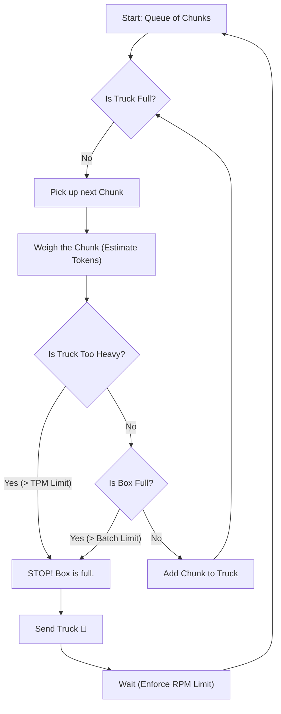

# Voyage AI Limits & Batching Explained

This document explains how Mamirri handles Voyage AI's rate limits and batching configurations, using a simple "Truck Delivery" analogy.

## The Analogy: Moving Books

Imagine you are moving a pile of heavy books (your **text chunks**) onto a truck (the **Voyage API**) to send them to the library (your **database**).

You have strict rules from the Truck Company (Voyage AI Free Tier):

1.  **Speed Limit (RPM)**: You can only send **2 trucks per minute**.
2.  **Weight Limit (TPM)**: Each truck can carry a maximum of **9,000 lbs** (tokens).
3.  **Box Size (Batch Limit)**: The truck's cargo box can physically hold a maximum of **1,000 items**.

---

## Configuration Variables

### 1. `VOYAGE_RATE_LIMIT_TPM` (The Weight Limit)

- **Default:** `9000` (Safety margin applied to 10k limit)
- **What it does:** Stops the truck from being too heavy.
- **Why it matters:** Even if you have space for more books, if the total weight (tokens) exceeds this number, the API will reject it ("Quota Exceeded").

### 2. `VOYAGE_REALTIME_BATCH_LIMIT` (The Box Size)

- **Default:** `1000`
- **What it does:** Stops you from putting too many individual items in one truck.
- **Why it matters:** Even if you are moving tiny sticky notes (very light), the API cannot handle more than 1,000 individual items in a single request structure.

---

## The Logic Flow

The system dynamically decides how many books to put in the truck by checking **both** limits simultaneously.

## Scenarios

### Scenario A: Heavy Books (Standard Medical Text)

- **Chunk Size:** 500 words (~700 tokens)
- **Limit Hit First:** **Weight Limit (TPM)**
- **Outcome:** The system puts about **12 chunks** (8,400 tokens) in the truck and sends it.
- _The Batch Limit (1000) is irrelevant here because we hit the weight limit way before filling the box._

### Scenario B: Tiny Notes (Short Strings)

- **Chunk Size:** 5 words (~7 tokens)
- **Limit Hit First:** **Box Size (Batch Limit)**
- **Outcome:** The system puts **1,000 chunks** (7,000 tokens) in the truck and sends it.
- _Here, we are under the weight limit, but we hit the API's "max items per request" limit._

## Summary

You need **both** variables configured correctly to ensure "flawless" execution:

- **TPM** protects your account quota (money/credits).
- **Batch Limit** protects against API format errors (technical constraints).

---

## Technical Appendix: API Capabilities

### Can we send multiple chunks at once?

**YES.** The Voyage AI `/v1/embeddings` endpoint accepts a **list of strings**.

> **Source:** [Voyage AI Documentation](https://docs.voyageai.com/reference/embeddings-api)
>
> `input` (string or **array of strings**): A single text string, or **a list of text strings** to embed.

### Why not send 1,000 chunks at once?

While the API technically allows up to 1,000 items (for newer models), doing so with standard text would exceed your **10,000 TPM limit** instantly.

**The Math:**

1. 1,000 chunks × ~700 tokens/chunk = **700,000 tokens**
2. Your Limit = **10,000 tokens**
3. Result = **CRASH** 💥

This is why our system intelligently groups chunks into smaller batches (e.g., ~10-12 chunks) that fit perfectly within your 9,000 TPM safety limit.

---

## Quick Reference: Sync vs Async

| Feature          | **Synchronous** (Real-time)              | **Asynchronous** (Batch) |
| :--------------- | :--------------------------------------- | :----------------------- |
| **Endpoint**     | `/v1/embeddings`                         | `/v1/batches`            |
| **Input Format** | List of strings (e.g. `["A", "B", ...]`) | JSONL file (upload)      |
| **Max Items**    | 1,000 (but limited by TPM)               | 100,000 items            |
| **Response**     | Immediate (Seconds)                      | Delayed (Hours)          |
| **Best For**     | Search queries, small updates            | Ingesting entire books   |

### How they work

**Synchronous (Real-time):**

- **Can I send multiple chunks?** YES!
- **Why?** It's faster. Sending 10 chunks in one request is faster than 10 separate requests.
- **Example Flow:**
  1.  Request 1: `["chunk 1", ... "chunk 10"]` (7,000 tokens) -> **Sent!**
  2.  _Wait 30s (Rate Limit)_
  3.  Request 2: `["chunk 11", ...]`

**Asynchronous (Batch):**

- **Can I send thousands?** YES!
- **Example Flow:**
  1.  Create File: `chunks.jsonl` containing **5,000 chunks**.
  2.  Upload -> Start Job -> **Wait 2 hours**.
  3.  Download 5,000 vectors at once.
