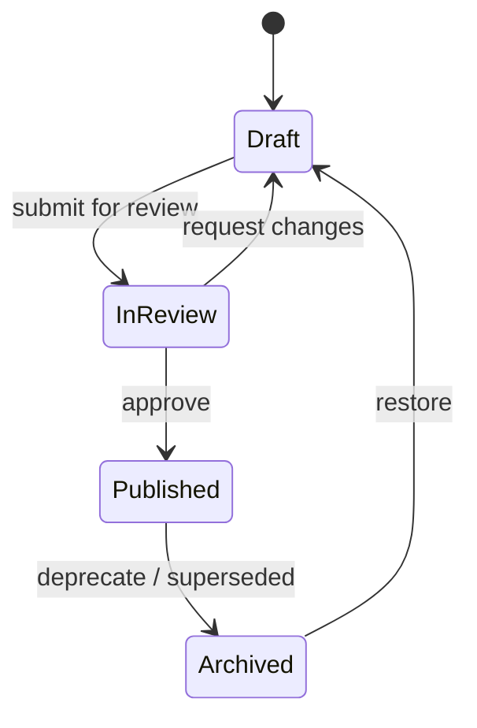

# Biblioteca Search Flow (Current vs Proposed)

## Current Flow (As Implemented)

```mermaid
flowchart TD
  U[User types query (e.g. "huesos")] --> SB[LibrarySearchBar onSearch]
  SB --> Q[setSearchQuery(query)]
  Q --> G{query.length >= 3?}
  G -- No --> NS[No search request (React Query disabled)]
  G -- Yes --> API[GET /library/protocols?q=query]

  API --> C[LibraryController.findProtocols]
  C -->|if dto.q| S[LibraryService.search(query)]
  S --> PDB[Prisma: title/definition contains OR tags has exact]
  S --> KB[KnowledgeBaseService.findSimilar(query, 5)]
  PDB --> R1[protocols[]]
  KB --> R2[ragResults[]]
  R1 --> RESP[{protocols, ragResults}]
  R2 --> RESP

  RESP --> UI[UI renders ProtocolList(protocols)]
  UI -->|protocols.length == 0| EMPTY["No se encontraron protocolos"]
  UI -->|protocols.length > 0| LIST[Protocol cards]
  RESP -.-> NOTE[ragResults not rendered in UI]

  LIST -.-> ADD["Add to plan" action]
  ADD -.-> GAP[Not wired in UI (hook exists only)]
```

## Proposed Flow (Hybrid: Answers + Protocols)

Principle: a simple term search should _always_ show something useful when the knowledge base has evidence, even if there are no curated protocols.

```mermaid
flowchart TD
  U[User types query] --> SB[LibrarySearchBar]
  SB --> API[GET /library/protocols?q=query]
  API --> RESP[{protocols, ragResults}]

  RESP --> A[Answer block (AI-assisted)]
  A --> AR[Top 1-3 ragResults as snippets]
  AR --> CIT[Citations + relevance]

  RESP --> PR[Protocols block (Curated)]
  PR -->|protocols.length > 0| PL[Protocol cards]
  PR -->|protocols.length == 0| PEMPTY["No curated protocols match \"query\"" + explain protocols]

  PEMPTY --> SUG[Suggestions: synonyms + categories]
  SUG --> CAT[Browse categories]

  A --> FILTER[Toggle: All | Answers only | Protocols only]
  PR --> FILTER

  PL --> ADD2[Add protocol to patient plan]
  ADD2 --> API2[POST /library/treatment-plans/:planId/protocols]
  API2 --> PLAN[Patient TreatmentPlan shows attached protocols]
```

## Protocol Lifecycle (How To "Handle Protocols")



Rules:

- Search and browse show only `Published` protocols.
- Draft/InReview are visible only to editors/reviewers.
- Each Published protocol shows: ReviewedBy + ReviewedOn + Version.

## Why Protocols Exist (Even if Search Returns Answers)

Protocols are the curated, step-by-step, clinic-approved techniques. They exist because they are:

- Actionable (procedure steps, tags, references)
- Reviewable (draft/review/publish)
- Safe to add to treatment plans (clear ownership + auditability)

RAG answers/snippets are for fast help and learning, but they are not necessarily a standardized pathway.
